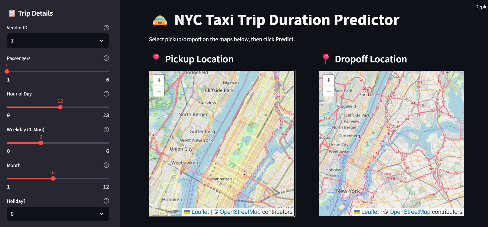

# 🚕 NYC Taxi Trip Duration Prediction

This project predicts the duration of New York City taxi rides using machine learning and deep learning models.  
It includes a complete data science pipeline (EDA, feature engineering, modeling) and a **user-friendly UI** for predictions.

---

## 📌 Project Overview

The goal is to estimate taxi trip durations accurately based on trip and location features.  
This can help optimize ride planning, improve scheduling, and support real-time trip management.

---

## 🧠 Models Used

- **Random Forest** (Scikit-learn)  
- **XGBoost** (Gradient Boosting)  
- **LSTM** (PyTorch) for sequence modeling of trips  

### Key Techniques:
- Log-transforming trip duration for better predictions  
- Feature engineering: distance, pickup/dropoff times, day-of-week, and more  
- Evaluation: RMSE and MAE metrics on validation set  

---

## 📊 Dataset

- **Source:** [Kaggle – NYC Taxi Trip Duration](https://www.kaggle.com/c/nyc-taxi-trip-duration)  
- **Note:** Full dataset is not included due to size; only a **sample CSV** is provided for testing.  

---

## 🛠 Tech Stack

| Layer        | Technology                   |
|--------------|-----------------------------|
| Backend      | FastAPI                     |
| Frontend     | Streamlit                   |
| Data Science | Python, Pandas, NumPy       |
| ML Models    | Scikit-learn, XGBoost, PyTorch |
| Visualization| Matplotlib, Seaborn         |

---

## 🖥️ Deployment

### Backend API
- File: `app/main.py`  
- Built with **FastAPI**  

### Frontend UI
- File: `ui/streamlit_app.py`  
- Built with **Streamlit**  

The app allows users to **input trip details** and receive predicted trip durations in seconds.

---

## 📸 Screenshots

  
*Example of the user interface to input trip details and get predictions.*

---

## 🚀 How to Run

### 1️⃣ Optional: Create Virtual Environment
```bash
python -m venv venv
# Windows
venv\Scripts\activate
# macOS / Linux
source venv/bin/activate
 ```

### 2️⃣ Install Dependencies
```bash
pip install -r app/requirements.txt
 ```
### 3️⃣ Run Backend API
```bash
cd app
uvicorn main:app --reload
 ```
### 4️⃣ Run Streamlit UI (new terminal)
```bash
cd ui
streamlit run streamlit_app.py
 ```

Now open the UI in your browser and test predictions.

### 📈 Results
Model	RMSE	MAE
Random Forest	4.48	2.91
XGBoost	4.43	2.76
LSTM	4.55	2.83

### 📎 Future Improvements

Deploy the app to Streamlit Cloud or Heroku for online access

Integrate real-time NYC taxi data for live predictions

Add hyperparameter tuning and model ensembling

Add interactive maps to visualize routes and distances

### 👩‍💻 Author

Fatima Binte Tanveer

### 📄 License

This project is open-source and available for educational purposes.
Feel free to fork, experiment, and improve!